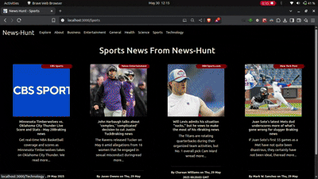
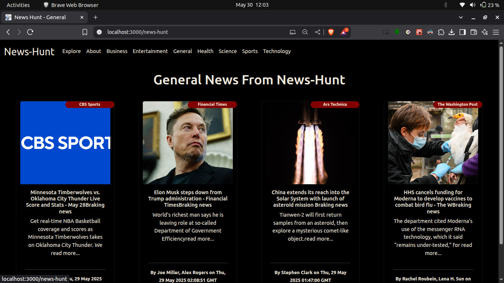
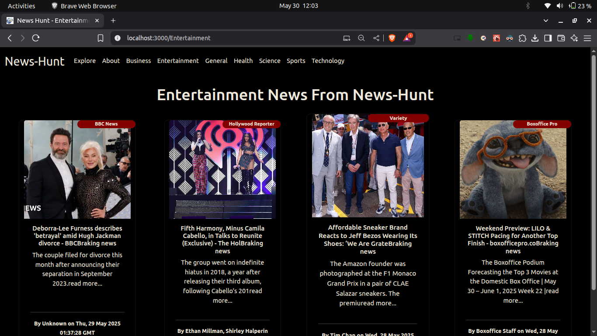
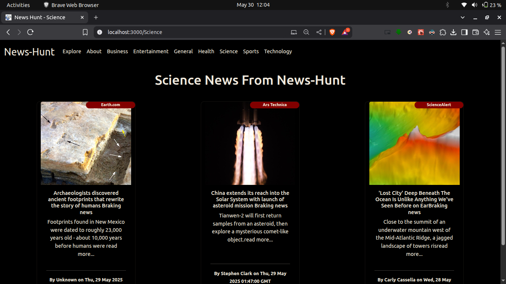
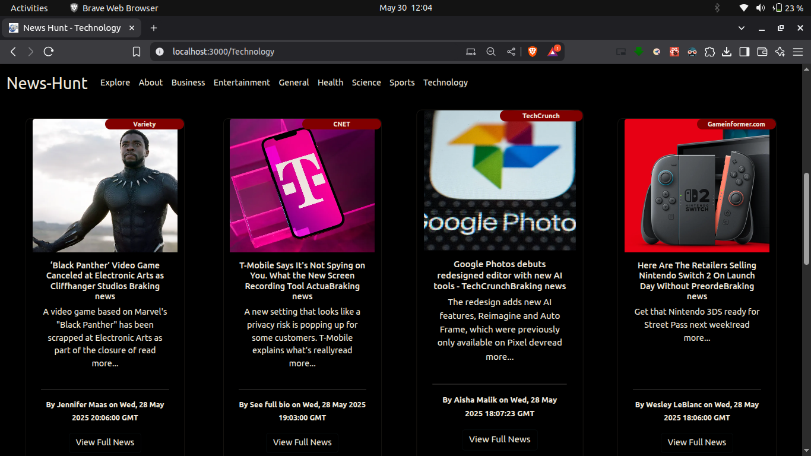
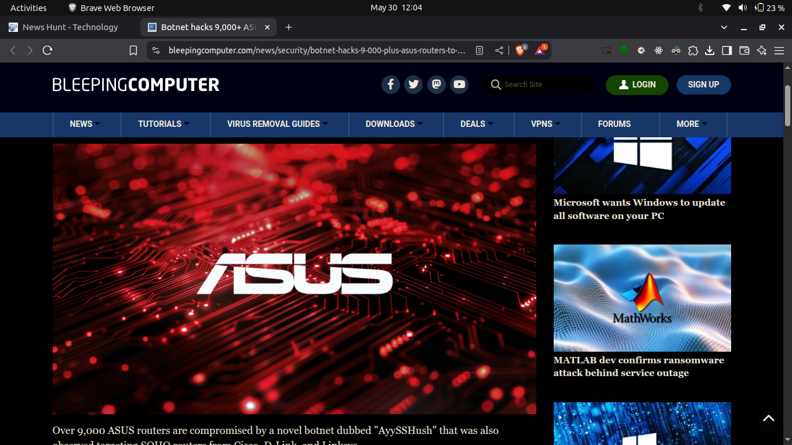

# 🗞️ News-Hunt

**News-Hunt** is a real-time news aggregator web app that displays the latest headlines using the [News API](https://newsapi.org/). This project is intended for demo purposes and currently works only on `localhost`.

🔗 **GitHub Repo:** [BhukyaKishore/news-hunt](https://github.com/BhukyaKishore/news-hunt)

> ⚠️ The News API is accessible only on `localhost` for this demo setup.
>  Demo web-app loded from json file [News-Hunt](https://bhukyakishore.github.io/news-hunt/).

---

## 📌 Features

- 📰 Live news fetched from the News API
- 🔍 Categorized  news filtering
- 🧑‍💻 Simple, clean, and responsive user interface
- ⚡ Fast updates with real-time rendering

---

## 🛠️ Tech Stack

- **HTML**  
- **Bootstrap**  
- **JavaScript (React)**  
- [NewsAPI.org](https://newsapi.org/)

---

## 📦 How to Run Locally

1. **Clone the repository**
   ```bash
   git clone https://github.com/BhukyaKishore/news-hunt-master.git
   //mater branch https://github.com/BhukyaKishore/news-hunt/tree/master
   cd news-hunt-master
   npm i
   npm start run```
 2. **Add your News API Key**

- Sign up at [NewsAPI.org](https://newsapi.org/) to get your free API key.
- Open `script.js` or your environment file and replace the placeholder API key:

```javascript
const apiKey = "your_api_key_here";
````
## 🎥 Demo (GIF)



## 📸 Screenshots

### 🏠 Home Page


### 👨‍✈️ Business View


### 🎠 Entertainment Page


### 🔬 Science Page


### 🤖 Technology Page



### 📄 news-view View


## 👤 Author

**Bhavani Kishore**  
💼 GitHub: [@BhukyaKishore](https://github.com/BhukyaKishore)

📝 LinkedIn: [kishore](https://www.linkedin.com/in/kishore-bhukya/) 


Thank you ❤️
